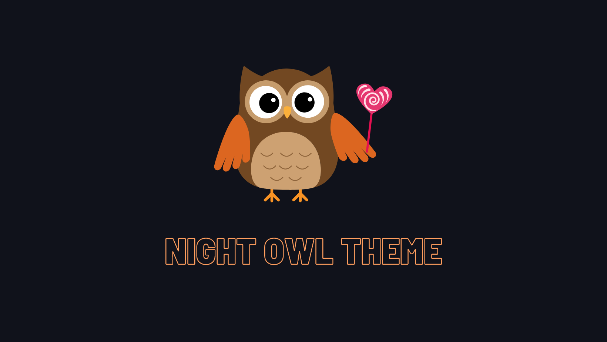

---
## Table of contents

A theme that is optimized for working at night, with a calm and relaxing atmosphere.

- [Table of contents](#table-of-contents)
- [Getting started](#getting-started)

## Getting started

You can install this awesome theme through the [Visual Studio Code Marketplace](#).